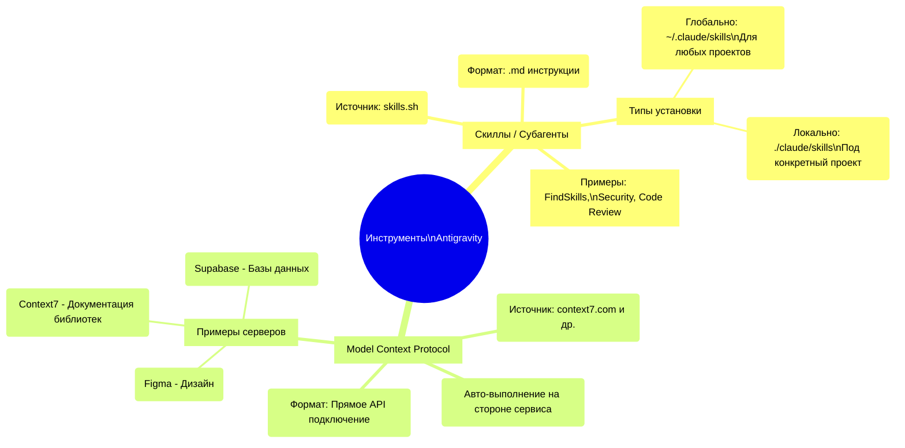

# 📊 Инфографика: Регламент разработки Vibecoding

Данная инфографика визуализирует полный жизненный цикл создания цифрового продукта, а также работу с дополнительными инструментами (Скиллы и MCP), согласно единому регламенту.

## 🔄 Жизненный цикл продукта (От идеи до релиза)

```mermaid
flowchart TD
    %% Стили узлов
    classDef startEnd fill:#f9f,stroke:#333,stroke-width:2px,color:#000
    classDef prefill fill:#fff3cd,stroke:#ffc107,stroke-width:2px,color:#000
    classDef concept fill:#d1ecf1,stroke:#17a2b8,stroke-width:2px,color:#000
    classDef logic fill:#e2e3e5,stroke:#6c757d,stroke-width:2px,color:#000
    classDef action fill:#d4edda,stroke:#28a745,stroke-width:2px,color:#000
    classDef check fill:#f8d7da,stroke:#dc3545,stroke-width:2px,color:#000

    Start([Начало работы]) ::: startEnd --> E0
    
    subgraph Подготовка
        E0(Этап 0: Подготовка 🧹\nОчистка контекста\nи чек-лист) ::: prefill
    end
    
    subgraph Проектирование
        E0 --> E1(Этап 1: Идея продукта 💡\nФормулировка, ЦА,\nсохранение в 1_идея.md) ::: concept
        E1 --> E2(Этап 2: Техническое задание 📋\nСкелет продукта,\n2_техническое_задание.md) ::: concept
        E2 --> E3(Этап 3: Архитектура проекта 🏗️\nФайловая структура,\n3_архитектура_проекта.md) ::: concept
        E3 --> E4(Этап 4: Требования дизайну 🎨\nИнтерфейс и цвета,\n4_требования_к_дизайну.md) ::: concept
    end
    
    subgraph Разработка & Тестирование
        E4 --> E5(Этап 5: Запуск локально 🚀\nГенерация кода,\n5_запуск_продукта.md) ::: action
        E5 -.-> E51[Этап 5.1: Задачи ✅\nДекомпозиция списка задач] ::: logic
        E5 --> E6{Этап 6: Тестирование 🧪\nПроверка функций} ::: check
        E6 -- Найдены баги --> E5
        E6 -- Работает стабильно --> E7
    end
    
    subgraph Продакшн
        E7(Этап 7: Деплой 🌐\nСервер, БД, URL,\n7_деплой.md) ::: action
        E7 --> E8{Этап 8: Дебаггинг 🐛\nПроверка на сервере} ::: check
        E8 -- Найдены ошибки --> E7
        E8 -- Всё работает --> E9
        
        E9(Этап 9: Релиз 🎉\nДоступ пользователям,\n9_релиз.md) ::: action
    end
    
    E9 --> E10(Этап 10: Пост-релиз 🔁\nСбор обратной связи,\nАналитика) ::: prefill
    E10 -.-> |Новая итерация улучшений| E0
```

---

## 🧩 Оснащение агента: Скиллы и MCP



---

## ⚠️ Правила работы (Топ-5)

1. **Один этап — один шаг:** Не перескакивайте (Идея ➜ ТЗ ➜ Архитектура)
2. **Accept All / Reject All:** Подтверждайте синей кнопкой, если ок. Откатывайте `Reject`, если код сломался.
3. **Работает продукт или не работает:** Не оценивайте качество сгенерированного кода, важен конечный функционал.
4. **Конфликт терминала на Windows:** Ставьте глобальный скилл для фикса PowerShell.
5. **Безопасность AI:** AI не автономен — сохраняйте бекапы в GitHub и контролируйте ход разработки.

---

## 🛠 Ключевые файлы контекста (Артефакты)
Каждый этап завершается сохранением Markdown-файла:
- `1_идея.md`
- `2_техническое_задание.md`
- `3_архитектура_проекта.md`
- `4_требования_к_дизайну.md`
- `5_запуск_продукта.md` (и `5.1_задачи.md`)
- `6_тестирование.md`
- `7_деплой.md`
- `8_дебаггинг.md`
- `9_релиз.md`
